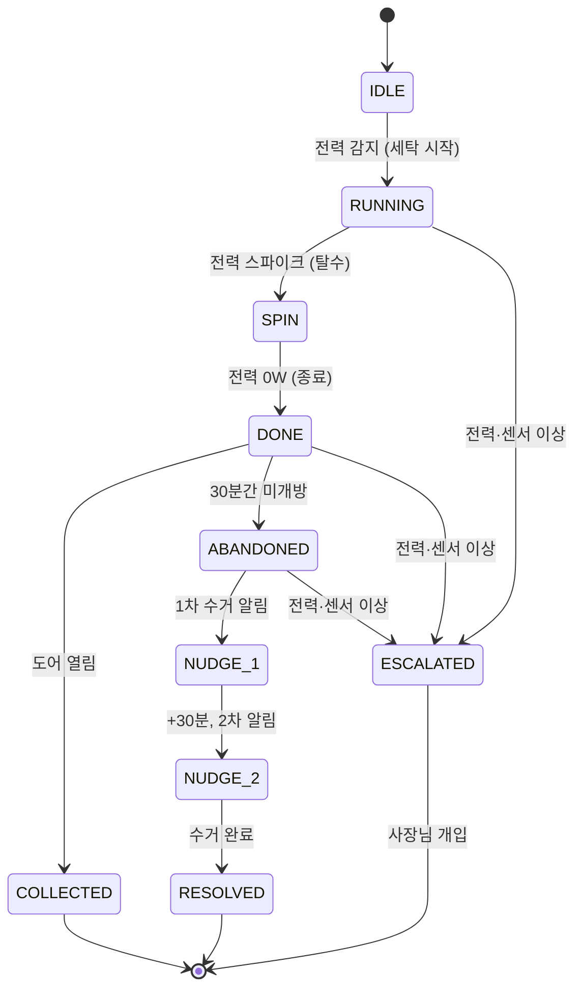

# 빨래집사 🧺

**무인빨래방의 방치 세탁물을 스스로 감지하고 대응하는 AI 운영 에이전트**

## 문서

- [기획서 (문제 정의 · 시나리오 · 핵심 기능 · 로드맵)](docs/plan.md)
- [작업 분해 체크리스트](docs/checklist.md)
- [프로토타입 (순수 HTML/CSS)](docs/prototype.html)
- [CLAUDE.md (구현 규칙 · 상세 설계)](CLAUDE.md)

## 문제 상황

무인빨래방은 운영자가 항상 매장에 상주하지 않기 때문에, 세탁이 끝난 뒤에도 고객이 세탁물을 오랫동안 찾아가지 않는 방치 문제가 자주 발생합니다.

방치된 세탁물은 다음 고객이 기계를 이용하지 못하게 하고, 매장 회전율을 떨어뜨리며 민원을 유발합니다. 결국 사장님은 CCTV를 확인하거나 직접 고객에게 연락하는 등 지속적으로 매장을 신경 써야 합니다.

## 해결 아이디어

빨래집사는 상태를 보여주기만 하는 관리 시스템이 아니라, 운영자가 하던 반복 업무를 대신 수행하는 **AI Agent**입니다.

```text
감지(Observe) → 판단(Think) → 행동(Act)
```

스마트플러그의 전력 데이터와 도어 센서로 기계 상태를 **사람의 입력 없이** 감지하고, 세탁이 끝난 뒤 수거되지 않으면 스스로 방치를 판단해 고객과 사장님에게 단계적으로 대응합니다.

> 사용자가 요청해야 반응하는 기능은 이 서비스의 방향이 아닙니다. QR 알림 신청은 어디까지나 선택 기능이며, 신청하지 않아도 세탁 상태는 계속 추적됩니다.

## 핵심 기능

| 기능 | 설명 |
|------|------|
| 기계 상태 자동 감지 | 전력 패턴으로 세탁 시작·탈수·종료를, 도어 센서와 조합해 수거 완료·방치를 판정 |
| 방치 자동 대응 | 완료 알림 → 단계적 수거 알림 → 사장님 보고. 연락처 없는 고객은 다음 이용 고객에게 안내 |

이번 MVP는 이 두 가지에 집중합니다. 재고 관리, 자동 발주, 환불 처리, 매출 분석, 다중 매장 관리는 의식적으로 제외했습니다.
최종 목표는 매장 전체를 관리하는 **AI 점장**입니다. ([로드맵](docs/plan.md#12-확장-로드맵))

## 행동 등급

AI의 행동은 **되돌릴 수 있는가**와 **돈이 나가는가**를 기준으로 세 단계로 관리합니다.

| 등급 | 설명 | 예시 |
|------|------|------|
| 1단계 | 자동 실행 | 완료 알림, 방치 대응 |
| 2단계 | 알림 후 실행 | 원격 재부팅 |
| 3단계 | 승인 후 실행 | 발주, 환불 |

3단계 행동은 승인 대기함에 등록되며 사장님의 승인 후에만 실행됩니다.

## 세션 상태 전이



전이 트리거는 전력 패턴(시작·탈수·종료), 도어 센서(열림), 타이머(30분 → 방치, +30분 → 2차 넛지)입니다.
`ESCALATED`는 에이전트가 처리할 수 없는 이상 상황으로, 어느 단계에서든 발생할 수 있습니다.

## 화면

| 화면 | 주요 기능 | 사용자 |
|------|-----------|--------|
| QR 랜딩 (`/m/:machineId`) | 알림 신청, 기계 상태 확인 | 고객 |
| 진행 화면 | 예상 종료 시간, 현재 상태 | 고객 |
| 사장님 대시보드 (`/owner`) | 기계 상태, 방치 현황, 처리 결과 | 사장님 |
| 승인 대기함 | 승인이 필요한 작업 확인 | 사장님 |

## 기술 구성

| 영역 | 사용 기술 |
|------|-----------|
| Frontend | React (Vite), `react-router-dom` |
| Backend | Express (Node.js) |
| Database | SQLite (`better-sqlite3`) |
| AI Logic | 전력 패턴 분석, 상태 머신(State Machine) |
| Hardware | 스마트플러그(Tapo P110M), Zigbee 문열림 센서 |
| Notification | Web Push API + Service Worker (VAPID) |
| 스타일 | 순수 CSS + CSS 변수 + CSS Modules (유틸 프레임워크 미사용) |

라이브러리 선택 사유와 상세 설계는 [CLAUDE.md](CLAUDE.md)에 있습니다. 여기 없는 라이브러리를 추가할 때는 사유와 함께 CLAUDE.md에 기록한 뒤 도입합니다.

## 실행 방법

```bash
npm install     # 의존성 설치
npm run dev     # 개발 서버 실행
npm run lint    # 린트 검사 (Oxlint)
npm run build   # 프로덕션 빌드
npm run preview # 빌드 결과 미리보기
```

## 디렉토리 구조

현재 저장소 (프론트엔드 스캐폴드):

```text
/src
  main.jsx          # 진입점
  ProjectIntro.jsx  # 프로젝트 소개 화면
/docs               # plan.md, checklist.md, prototype.html
CLAUDE.md           # 구현 규칙 · 상세 설계
```

앞으로 만들어 갈 구조:

```text
/client        # React 앱
  /src
    /components
    /pages     # 고객(m/*), 사장님(owner/*) 페이지
    /styles
/server        # Express API
  /routes
  /services    # 상태머신, 알림 등 도메인 로직
```

> `/server`와 하드웨어 연동은 아직 구현 전입니다. 개발 중에는 전력 데이터를 시뮬레이터(`server/scripts/simulate.js`)로 주입할 예정입니다.

## 개발 규칙

작업 전에 [CLAUDE.md](CLAUDE.md)를 먼저 읽습니다. 화면·컴포넌트를 만들 때는 디자인 시스템(`laundry-design` 스킬)을 적용하고, CLAUDE.md에 없는 결정이 필요하면 임의로 정하지 않고 팀에 묻습니다.

커밋은 `타입: 요약` 형식으로 작성하며, [체크리스트](docs/checklist.md)의 체크박스 1개를 커밋 1개로 하는 것을 기본으로 합니다.

```bash
git commit -m "feat: QR 랜딩 페이지 알림 신청 버튼 구현"
```
