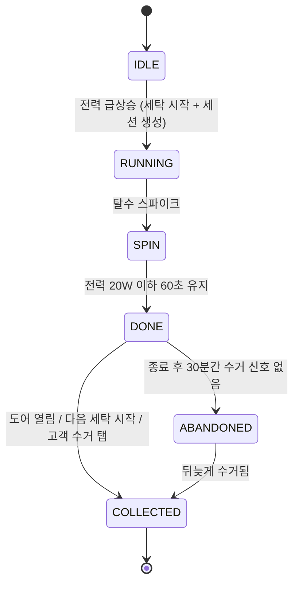
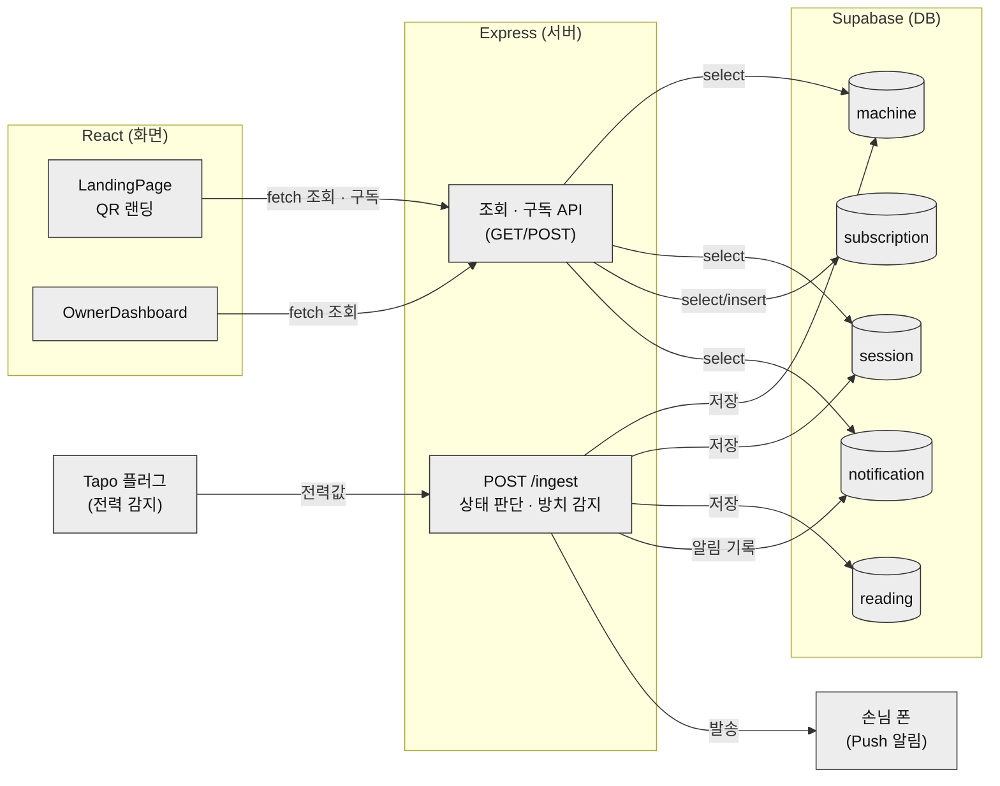

# 빨래집사 🧺

**무인빨래방의 방치 세탁물을 스스로 감지하고 대응하는 AI 운영 에이전트**

## 문서

| 문서 | 답하는 질문 |
|---|---|
| [기획서 `plan.md`](docs/plan.md) | **왜** 만드는가 — 문제 정의 · 시나리오 · 성공 지표 |
| [**백로그 `backlog.md`**](docs/backlog.md) | **무엇을 · 언제 · 누가** — Task 28개 · 우선순위 · 4주 로드맵 · **진행 상태** |
| [`CLAUDE.md`](CLAUDE.md) | 구현 규칙 · 상세 설계 (API Spec · Data Model · State Machine) |
| [프로토타입](docs/prototype.html) | 화면 시안 (순수 HTML/CSS) |

**지금 뭘 할지 모르겠다면 [백로그](docs/backlog.md)를 여세요.**

## 문제 상황

무인빨래방은 운영자가 항상 매장에 상주하지 않기 때문에, 세탁이 끝난 뒤에도 고객이 세탁물을 오랫동안 찾아가지 않는 방치 문제가 자주 발생합니다.

방치된 세탁물은 다음 고객이 기계를 이용하지 못하게 하고, 매장 회전율을 떨어뜨리며 민원을 유발합니다. 결국 사장님은 CCTV를 확인하거나 직접 고객에게 연락하는 등 지속적으로 매장을 신경 써야 합니다.

## 해결 아이디어

빨래집사는 상태를 보여주기만 하는 관리 시스템이 아니라, 운영자가 하던 반복 업무를 대신 수행하는 **AI Agent**입니다.

```text
감지(Observe) → 판단(Think) → 행동(Act)
```

스마트플러그의 전력 데이터와 도어 센서로 기계 상태를 **사람의 입력 없이** 감지하고, 세탁이 끝난 뒤 수거되지 않으면 스스로 방치를 판단해 고객과 사장님에게 단계적으로 대응합니다.

> 사용자가 요청해야 반응하는 기능은 이 서비스의 방향이 아닙니다. QR 알림 신청은 어디까지나 선택 기능이며, 신청하지 않아도 세탁 상태는 계속 추적됩니다.

## 핵심 기능

| 기능 | 설명 |
|------|------|
| 기계 상태 자동 감지 | 전력 패턴으로 세탁 시작·탈수·종료를, 도어 센서와 조합해 수거 완료·방치를 판정 |
| 방치 자동 대응 | 완료 알림 → 단계적 수거 알림 → 사장님 보고. 연락처 없는 고객은 다음 이용 고객에게 안내 |

이번 MVP는 이 두 가지에 집중합니다. 재고 관리, 자동 발주, 환불 처리, 매출 분석, 다중 매장 관리는 의식적으로 제외했습니다.
최종 목표는 매장 전체를 관리하는 **AI 점장**입니다. ([로드맵](docs/plan.md#12-확장-로드맵))

## 행동 등급

AI의 행동은 **되돌릴 수 있는가**와 **돈이 나가는가**를 기준으로 세 단계로 관리합니다.

| 등급 | 설명 | 예시 |
|------|------|------|
| 1단계 | 자동 실행 | 완료 알림, 방치 대응 |
| 2단계 | 알림 후 실행 | 원격 재부팅 |
| 3단계 | 승인 후 실행 | 발주, 환불 |

3단계 행동은 승인 대기함에 등록되며 사장님의 승인 후에만 실행됩니다.

## 세션 상태 전이

상태는 **6개만** 사용합니다. ([CLAUDE.md의 State Machine](CLAUDE.md)이 기준입니다)



전이 트리거는 전력 패턴(시작·탈수·종료), 도어 센서(열림), 타이머(30분 → 방치)입니다.

**1차·2차 수거 알림은 상태가 아닙니다.** `ABANDONED` 상태에서 발생하는 *행동*이며, 발송 이력은 `notification` 테이블에 남아 중복 발송을 막는 근거가 됩니다. 상태를 늘리지 않는 이유는 전이 경우의 수와 테스트가 그만큼 불어나기 때문입니다.

| ABANDONED 이후 | 조건 | 행동 |
|---|---|---|
| 알림 채널 있음 | QR 알림 신청함 | 1차 수거 알림 → (+30분) 2차 수거 알림 |
| 알림 채널 없음 | QR 미신청 | 사장님 알림 + QR 랜딩을 방치 안내 모드로 전환 |

센서·전력 이상 같은 예외 상황은 상태값이 아니라 대시보드의 **예외 상황** 영역에 표시합니다.

## 데이터 흐름 (아키텍처)

센서 데이터가 들어오는 경로(왼쪽)와 화면이 데이터를 읽어가는 경로(오른쪽)가 분리돼 있고, 둘 다 Supabase를 거칩니다. 알림은 상태 전이가 만든 결과물이지 화면이 직접 요청하는 게 아닙니다.



- **센서 → 서버**: `POST /ingest`가 전력값을 받아 상태를 판단하고, 그 결과로 DB 저장·알림 발송까지 한 번에 처리한다.
- **화면 → 서버 → DB**: 고객·사장님 화면은 조회·구독 API로만 DB에 접근한다 — 화면이 DB를 직접 보지 않는다.
- **알림은 화면이 요청하지 않는다**: 서버가 상태 전이를 판단한 시점에 스스로 손님 폰으로 보낸다.

## 화면

| 화면 | 주요 기능 | 사용자 |
|------|-----------|--------|
| QR 랜딩 (`/m/:machineId`) | 알림 신청, 기계 상태 확인 | 고객 |
| 진행 화면 | 예상 종료 시간, 현재 상태 | 고객 |
| 사장님 대시보드 (`/owner`) | 기계 상태, 방치 현황, 처리 결과 | 사장님 |
| 승인 대기함 | 승인이 필요한 작업 확인 | 사장님 |

## 기술 구성

| 영역 | 사용 기술 |
|------|-----------|
| Frontend | React (Vite), `react-router-dom` |
| Backend | Express (Node.js) |
| Database | Supabase (PostgreSQL), `@supabase/supabase-js` |
| AI Logic | 전력 패턴 분석, 상태 머신(State Machine) |
| Hardware | 스마트플러그(Tapo P110M), Tapo T110(문열림)·H100(허브) |
| Notification | Web Push API + Service Worker (VAPID), `web-push` |
| 스타일 | 순수 CSS + CSS 변수 + CSS Modules (유틸 프레임워크 미사용) |
| 모노레포 | npm workspaces + `concurrently` |

**추가 라이브러리와 사유**

| 라이브러리 | 사유 |
|---|---|
| `react-router-dom` | 고객(`/m/:machineId`)·사장님(`/owner`) 화면 분리에 필요 |
| `concurrently` | `npm run dev` 한 번으로 client·server를 함께 띄우기 위해 (터미널 2개 방지) |
| `cors` | client(5173) → server(3000) 교차 출처 요청 허용 |
| `@supabase/supabase-js` | Supabase(PostgreSQL) 클라이언트. SQLite에서 전환(2026-07-16) — 매장 1곳이지만 여러 위치·기기에서 같은 DB 접근 필요 |
| `web-push` | 서버에서 VAPID 기반 Web Push 발송 |

라이브러리를 추가할 때는 사유와 함께 이 표와 [CLAUDE.md](CLAUDE.md)에 기록한 뒤 도입합니다.

## 실행 방법

npm workspaces 모노레포입니다. **루트에서 한 번만 설치하면 `client`와 `server`가 함께** 잡힙니다.

```bash
npm install     # 의존성 설치 (루트 한 번으로 client·server 모두)
npm run dev     # client(5173) + server(3000) 동시 실행
npm run lint    # 린트 검사 (Oxlint)
npm run build   # 프로덕션 빌드
```

한쪽만 띄우려면 `npm run dev:client` / `npm run dev:server`를 씁니다.

개발 중 client의 `/api`·`/ingest` 요청은 Vite 프록시가 server(3000)로 넘깁니다. 프론트에서는 그냥 `fetch('/api/machines')`처럼 상대 경로로 부르면 됩니다.

## 디렉토리 구조

```text
/client                    # React (Vite) — 포트 5173
  /public                  # manifest.webmanifest · push-worker.js(Service Worker)
  /src
    App.jsx                # 라우팅
    /pages
      /m                   # 고객 — QR 랜딩(/m/:machineId), 진행 화면
      /owner               # 사장님 — 대시보드(/owner)
    /components
    /styles/tokens.css     # 디자인 토큰 (색·타이포·라운드·8pt 그리드)
    /mocks                 # mock 데이터 — 구조는 CLAUDE.md의 Data Model과 동일하게
/server                    # Express — 포트 3000
  index.js
  /routes                  # POST /ingest/:machineId · GET /api/machines 등
  /services                # 상태 머신 · 방치 대응 · Web Push 발송 · Supabase 클라이언트(db.js)
  /scripts                 # 센서 폴링(power_poll.py) · 시뮬레이터(simulate.mjs)
  /db/schema.sql           # Supabase 테이블 정의 (SQL Editor에서 1회 실행)
/docs                      # plan.md · backlog.md · prototype.html
CLAUDE.md                  # 구현 규칙 · 상세 설계
```

> 상태 머신·방치 대응·Web Push·조회 API까지 서버 핵심 로직은 구현·검증 완료 상태입니다. 개발 중에는 전력 데이터를 시뮬레이터(`server/scripts/simulate.mjs`)가, 실제 매장에서는 `power_poll.py`가 **운영과 동일한** `POST /ingest/:machineId`로 주입합니다. 진행 상황은 [백로그](docs/backlog.md)를 보세요.

## 개발 규칙

작업 전에 [CLAUDE.md](CLAUDE.md)를 먼저 읽습니다. 화면·컴포넌트를 만들 때는 디자인 시스템(`laundry-design` 스킬)을 적용하고, CLAUDE.md에 없는 결정이 필요하면 임의로 정하지 않고 팀에 묻습니다.

작업을 시작할 때는 [백로그](docs/backlog.md)에서 Task를 고르고 상태를 `🟡 진행`으로 바꿉니다. 둘이 같은 걸 잡는 사고를 막는 유일한 장치입니다. 끝나면 `✅ 완료`로 바꿉니다 — **진행 상황을 적어두는 곳은 백로그 하나뿐입니다.**

커밋은 `타입: 요약` 형식으로, 되돌릴 수 있는 가장 작은 단위로 나눕니다.

```bash
git commit -m "feat: QR 랜딩 페이지 알림 신청 버튼 구현"
```

## 역할

| 담당 | 영역 |
|---|---|
| **서원** (`swlog`) | `client/` 화면 3개 · 디자인 시스템 적용 · 시뮬레이터 |
| **도경** (`do-ttery`) | `server/` Express · Supabase · 상태 머신 · 알림 · Tapo 센서 |

두 사람이 만나는 지점은 [CLAUDE.md](CLAUDE.md)의 **API Spec과 Data Model 하나뿐**입니다. 이미 확정돼 있으므로 서로를 기다리지 않습니다. 프론트는 그 구조 그대로 mock으로 화면을 완성하고, 나중에 mock만 `fetch`로 갈아끼웁니다.
