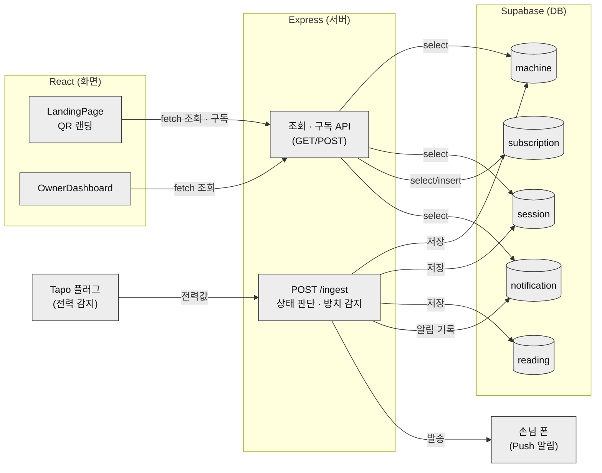

# 빨래집사 아키텍처 — 데이터 흐름

> 화면(client) · 서버(server) · DB(Supabase)가 어떻게 연결되고, 데이터가 어디로 흐르는지 한 장으로 정리한 문서입니다.
> README에도 같은 다이어그램이 있고, 이 문서는 거기에 설명을 붙인 버전입니다.

## 한 문장 요약

손님 세탁물 상태를 사람 없이 자동으로 감지하고, 방치되면 스스로 대응하는 구조입니다. 화면·서버·DB 세 레인으로 나눠서 봅니다.

## 다이어그램

## 순서대로 설명

### 1. 입력 경로 (센서 → 서버)

Tapo 스마트플러그가 세탁기 전력을 5초마다 읽어서 서버의 `POST /ingest` 단 하나로 보냅니다. 여기서 전력값만 보고 지금 세탁 중인지, 탈수 중인지, 끝났는지, 30분 넘게 안 찾아갔는지까지 서버가 스스로 판단하고, 그 결과를 DB(`machine`·`session`·`reading`)에 저장합니다.

개발 중에는 실제 센서 대신 시뮬레이터(`simulate.mjs`)가 값을 흘려보내지만, 들어가는 문은 똑같이 `POST /ingest`입니다. 경로를 따로 만들면 "개발에선 되는데 매장 가면 안 되는" 사고가 나서 처음부터 하나로 통일했습니다.

### 2. 출력 경로는 두 갈래로 갈립니다 — 여기가 핵심

이 서비스가 단순 대시보드가 아니라 **AI 에이전트**인 이유가 여기 있습니다.

- **화면 쪽 (조회)**: 고객·사장님 화면은 5초마다 서버에 "지금 상태 뭐야?" 물어봐서 그립니다. 화면은 DB를 직접 보지 않고 항상 서버(API)를 거칩니다.
- **알림 쪽 (행동)**: 화면이 요청해서 알림이 가는 게 아닙니다. 서버가 상태 전이(예: 30분 방치 확정)를 판단한 바로 그 순간, **스스로** 손님 폰으로 Push를 보냅니다.

조회는 화면이 물어봐서 오지만, 알림은 서버가 알아서 보낸다 — 이 비대칭이 **감지(Observe) → 판단(Think) → 행동(Act)** 구조를 데이터 흐름으로 보여주는 지점입니다.

## 설명하다가 발견한 것 (구조가 의도한 것들)

- **입력 문이 하나뿐입니다.** 실제 센서든 개발용 시뮬레이터든 전부 같은 `POST /ingest`로 들어옵니다.
- **DB가 5개 테이블로 고정돼 있습니다.** `machine`·`session`·`subscription`·`reading`·`notification` 외에는 임의로 늘리지 않습니다.
- **화면이 DB를 직접 보지 않습니다.** 두 화면 다 API를 거치게 강제했습니다 — 상태 판단 로직이 서버 한 곳에만 있어야 화면마다 결과가 어긋나지 않기 때문입니다.

## 마무리

손님은 QR 찍는 것도 선택이고, 아무것도 안 해도 이 파이프라인은 그대로 돌아갑니다. 그게 이 서비스가 "관리 도구"가 아니라 "에이전트"라고 부르는 이유입니다.

---

*이 문서는 화면(client)·서버(server)·DB(Supabase) 데이터 흐름을 정리한 것입니다. 실제 화면·API·상태 머신 세부 규칙은 [`CLAUDE.md`](../CLAUDE.md)를, 진행 상황은 [`backlog.md`](backlog.md)를 참고하세요.*
