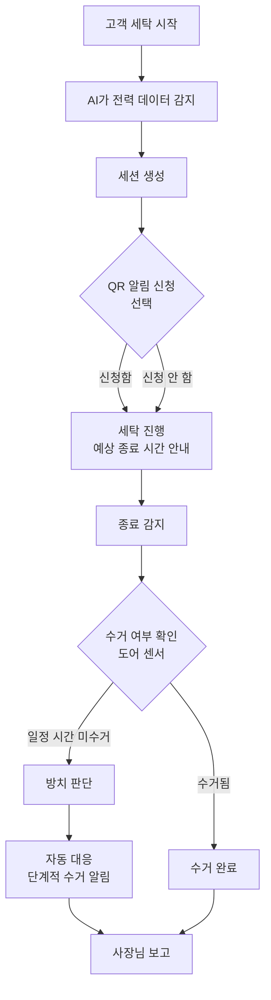

# 빨래집사

**무인빨래방의 방치 세탁물을 스스로 감지하고 대응하는 AI 운영 에이전트**

## 1. 문제 정의 (Problem Definition)

무인빨래방은 운영자가 항상 매장에 상주하지 않기 때문에 세탁이 끝난 뒤에도 고객이 세탁물을 오랫동안 찾아가지 않는 방치 문제가 자주 발생한다.

방치된 세탁물은 다음 고객이 기계를 이용하지 못하게 하고, 매장 회전율을 떨어뜨리며 민원을 유발한다. 결국 사장님은 CCTV를 확인하거나 직접 고객에게 연락하는 등 지속적으로 매장을 신경 써야 한다.

## 2. 서비스 목표 (Service Goal)

빨래집사는 무인빨래방 운영을 돕는 AI Agent이다.

최종적으로는

- 방치 관리
- 재고 관리
- 발주
- 고장 감지
- 운영 리포트

등 매장 전체를 관리하는 **'AI 점장'이 되는 것**을 목표로 한다.

하지만 이번 MVP에서는 가장 큰 문제인 방치 세탁물 자동 대응을 해결하는 데 집중한다.

빨래집사는 단순히 상태를 확인하는 관리 시스템이 아니라, 운영자가 수행하던 반복 업무를 대신 수행하는 AI Agent를 지향한다.

이를 통해 반복적인 운영 업무를 자동화하고, 향후 다양한 매장 관리 기능으로 확장할 수 있는 AI 점장의 기반을 마련한다.

## 3. 사용자 관점 동작 시나리오

### 고객

1. 고객이 세탁기를 사용한다.
2. AI가 전력 데이터를 통해 세탁 시작을 자동으로 감지한다.
3. 고객은 원하면 QR을 통해 알림을 신청한다.
4. 종료 시점이 가까워지면 AI가 출발 알림을 보낸다.
5. 세탁이 끝나면 완료 알림을 전달한다.

AI는 전력 데이터를 기반으로 세탁 시작부터 종료, 방치 여부까지 자동으로 감지한다. QR 알림은 선택 기능이며, 신청하지 않은 경우에도 세탁 상태는 계속 추적된다. 다만 고객에게 알림을 보낼 수 없기 때문에 방치 발생 시 사장님에게 안내한다.

알림을 신청하지 않은 고객의 세탁물이 방치된 경우, 빨래집사는 해당 기계와 방치 시간을 자동으로 파악해 사장님에게 알리고, 매장 운영 정책에 따라 다음 이용 고객에게 사용 가능 여부를 안내한다.

### AI Agent

1. 세탁 종료를 감지한다.
2. 일정 시간이 지나도 수거되지 않으면 방치를 판단한다.
3. 고객에게 단계적으로 수거 알림을 보낸다.
4. 연락처가 없는 경우 사장님에게 알리고 다음 고객이 사용할 수 있도록 안내한다.
5. 처리 결과를 사장님에게 보고한다.

### 사장님

사장님은 직접 지속적으로 매장을 확인하지 않아도 되고, AI가 처리하지 못하는 상황만 확인하면 된다.

## 4. 핵심 기능

### 4.1 기계 상태 자동 감지

AI는 스마트플러그의 전력 데이터와 도어 센서를 이용하여 사람의 입력 없이 다음 상태를 자동으로 판단한다.

- 세탁 시작
- 탈수
- 종료
- 수거 완료
- 방치 여부

수거 판정은 도어 센서를 기본으로 하며, 센서를 사용할 수 없는 경우에는 전력 데이터(다음 세탁 시작 감지)를 이용해 대체 판정을 수행한다.

**선정 이유**

- 기계 상태를 정확하게 감지해야 이후 모든 자동 대응이 가능하다.
- 사람의 입력에 의존하지 않아 실제 운영 환경에서도 지속적으로 사용할 수 있다.

### 4.2 방치 자동 대응

세탁 종료 후 일정 시간이 지나도 수거되지 않으면 AI가 자동으로 대응한다.

- 종료 알림
- 단계적 수거 알림
- 사장님 보고
- 연락처가 없는 고객은 다음 이용 고객에게 방치 안내

**선정 이유**

- 반복적인 운영 업무를 줄인다.
- 방치로 인한 회전율 저하와 민원을 최소화한다.

## 5. AI Agent 동작 원리

빨래집사는 단순한 알림 서비스가 아니라 **감지(Observe) → 판단(Think) → 행동(Act)** 을 수행하는 AI Agent이다.

행동은 위험도에 따라 세 단계로 관리한다. 등급은 **"되돌릴 수 있는가"와 "돈이 나가는가"** 를 기준으로 나눈다.

| 등급 | 설명 | 예시 |
| --- | --- | --- |
| 1단계 | 자동 실행 | 완료 알림, 방치 대응 |
| 2단계 | 알림 후 실행 | 원격 재부팅 |
| 3단계 | 승인 후 실행 | 발주, 환불 |

3단계 행동은 승인 대기함에 등록되며 점주의 승인 후에만 실행된다.

## 6. 화면 구조 (UI)

| 화면 | 주요 기능 | 사용자 |
| --- | --- | --- |
| QR 랜딩 화면 | 알림 신청, 기계 상태 확인 | 고객 |
| 진행 화면 | 예상 종료 시간, 현재 상태 | 고객 |
| 사장님 대시보드 | 기계 상태, 방치 현황, 처리 결과 | 사장님 |
| 승인 대기함 | 승인이 필요한 작업 확인 | 사장님 |

## 7. 화면 흐름

알림을 신청하지 않은 고객도 세탁 상태는 계속 추적된다. 다만 알림을 보낼 수 없으므로 방치 발생 시 사장님에게 안내한다.

## 8. 기술 구성

- Frontend : React (Vite)
- Backend : Express
- Database : SQLite
- AI Logic : 전력 패턴 분석, 상태 머신(State Machine)
- Hardware : 스마트플러그(Tapo P110M), Zigbee 문열림 센서
- Notification : Web Push API

구현 규칙과 상세 설계는 `CLAUDE.md`를 기준으로 한다.

## 9. 리스크와 검증 계획

- 세탁기 정격 전류 및 배선 방식 확인, 필요 시 CT 센서 적용
- 도어 센서 오탐 여부 실측 검증
- iOS 웹 푸시 제약은 MVP에서 폴링 방식으로 보완
- 범위 확장 리스크 → 실제 구현은 방치 자동 대응 하나로 고정

## 10. 성공 지표

빨래집사의 목표는 방치를 없애는 것이 아니라 운영 부담을 줄이는 것이다.

- 평균 방치 지속 시간 감소
- 사장님 개입 횟수 감소
- 오탐 알림 최소화

위 지표는 세션 로그, 센서 이벤트, 알림 기록을 기반으로 측정하며 빨래집사가 실제 운영 부담을 얼마나 줄였는지 평가하는 기준으로 활용한다.

## 11. 이번 MVP에서 제외하는 기능

- 재고 관리
- 자동 발주
- 환불 처리
- 매출 분석
- 다중 매장 관리
- AI 운영 리포트 고도화

## 12. 확장 로드맵

### Phase 1 (MVP)

- 기계 상태 자동 감지
- 방치 자동 대응

### Phase 2

- 고장 감지
- 운영 리포트
- 연락처 자동 확보

### Phase 3

- 재고 관리
- 자동 발주
- 환불 처리
- 매출 분석
- **AI 점장 완성**
