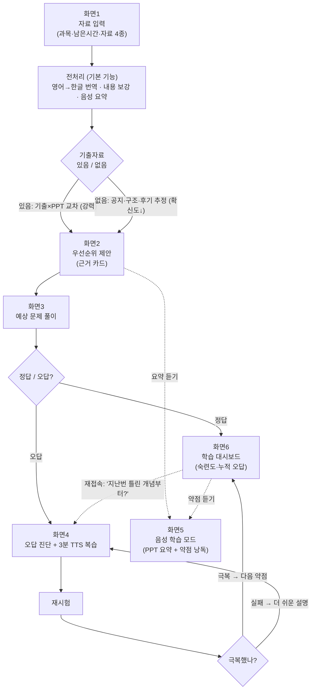

# ExamCast 기획안

> 기출자료와 강의자료를 교차 분석해 공부 우선순위를 근거와 함께 제안하고, 오답 기반으로 재학습시키는 AI 학습 Agent

---

## 1. 문제 정의

**시험을 앞둔 대학생은 자료가 부족해서가 아니라, 손에 쥔 기출·강의자료·후기를 조합해 "어디부터 공부할지" 정하는 일을 전부 혼자 해야 해서 막막하다.**

- 많은 교수님이 3개년 기출과 문제 유형까지 배포하므로 자료는 이미 학생 손에 있다. 부족한 건 자료가 아니라 **자료를 엮어 우선순위로 바꾸는 과정**이다.
- 기출 3개년과 이번 학기 PPT를 대조해 반복·변형·신규 개념을 가려내는 일은 손으로 하기 어렵다.
- 예상 문제를 틀려도 그 오답이 "어떤 개념이 약한지"라는 진단으로 이어지지 않아, 매번 무엇을 다시 볼지 학생이 스스로 정해야 한다.

---

## 2. 사용자 시나리오

> 아래는 서비스 동작을 보여주기 위한 **예시 시나리오**(가상 사례)다. 실제 데이터 검증은 9장 백테스트에서 실제 수강 과목으로 별도 수행한다.

운영체제 시험 3일 전인 대학생 지민.

1. **[입력 화면]** 과목명 "운영체제", 남은 시간 "3일", 기출자료 "있음"을 선택하고 강의 PPT·기출 2개년·시험 공지·후기를 입력창에 붙여넣은 뒤 **분석 시작**을 누른다.
2. **[우선순위 화면]** "페이지 교체 알고리즘 — 기출 3년 연속 출제 + 올해 PPT 9주차 존재"처럼 **근거 카드**가 붙은 공부 우선순위 리스트를 받는다.
3. **[문제 풀이 화면]** 우선순위 기반 예상 문제를 화면에서 풀다가 TLB 관련 문제를 틀린다.
4. **[오답 진단 화면]** Agent가 "TLB miss와 page fault 혼동 → 주소 변환 흐름 이해 부족"으로 약점을 진단하고, 그 개념만 다루는 **3분 복습 콘텐츠를 TTS로 재생**한다.
5. 유사 문제로 재시험을 봐 극복을 확인하면 숙련도 게이지가 오르고, Agent가 다음 약점 복습을 제안한다.

---

## 3. 핵심 기능 2개

기획문서 5장은 ExamCast의 핵심을 **"두 개의 엔진"**으로 명시하고, 12장 MVP는 이 둘을 잇는 체이닝(교차분석 → 출제 → 진단 → 플래너)을 아키텍처의 중심에 둔다. "이게 없으면 서비스가 안 돌아가는" 기준으로 다음 두 가지를 선정한다.

### 기능 1. 교차 분석 엔진 — 근거 카드 우선순위 제안 (문서 8-1 / 8-2)

학생이 입력한 기출·PPT·공지·후기를 서로 대조해, 무엇부터 왜 공부하면 좋은지를 **근거와 함께** 우선순위 카드로 제안한다.

**왜 핵심인가**
- 이 기능이 없으면 ExamCast는 다른 요약 도구와 구분되지 않는다. **학생 개인만 가진 데이터 조합(특정 교수님의 기출 × 이번 학기 PPT × 그 수업의 후기)을 우선순위로 바꾸는 것이 제품의 존재 이유**다(문서 6-1 차별점).
- 기출 유무에 따라 분석 전략을 스스로 분기하는 지점이 "요약이 아니라 전략", 즉 **Agent다움을 처음 드러내는 곳**이다(문서 6-4).

**근거 검증 장치 (신뢰 실패 대비)** — 근거가 잘못 연결되면(예: PPT에 없는 개념을 "9주차 존재"로 표기) 신뢰가 크게 깎인다. 각 근거 카드에 **원본 위치(어느 슬라이드·어느 기출 문항)를 함께 보여주고, 학생이 "이건 아닌 것 같다"를 표시**하면 해당 카드의 가중치를 낮추거나 우선순위에서 내리도록 한다. 학생 피드백은 오답 루프의 숙련도 데이터와 마찬가지로 다음 제안의 입력이 된다.

### 기능 2. 오답 루프 엔진 — 진단 → TTS 복습 → 재시험 → 숙련도 (문서 8-3 / 8-4)

예상 문제 풀이 결과를 관찰해 오답을 개념 단위 약점으로 진단하고, 그 개념만 복습(TTS)시킨 뒤 재시험으로 극복 여부를 확인하며 숙련도를 누적한다.

**왜 핵심인가**
- 기획문서가 **"오답 루프가 이 프로젝트의 정체성"(13장)**이라고 직접 못박았다. 다른 기능을 줄여도 이 루프의 완성도는 지키라고 명시한다.
- 오답과 숙련도가 다음 제안의 입력으로 **누적되는 상태**가 챗봇으로 재현할 수 없는 해자다(문서 6-2). 또한 이 루프는 **기출이 없어도 동작**하므로 전체 사용자에게 가치를 준다(문서 6-3).

**진단 정확도 확보 (오답 판정의 신뢰)** — 루프가 돌려면 "맞다/틀렸다" 판정이 먼저 옳아야 한다. 판정이 틀리면 약점 진단·복습·재시험이 통째로 어긋난다. 그래서 채점 정확도를 다음처럼 단계별로 다룬다.
- MVP는 **객관식·OX를 우선**해 판정을 확정적으로 만들고, 오답 루프의 완성도를 여기서 먼저 증명한다.
- 서술형은 **키워드 채점 + 애매 구간 명시**로 처리한다. 키워드는 맞았지만 개념이 틀린 답, 표현은 달라도 맞은 답이 생기므로, 판정이 애매한 문항은 **"이 답 맞음/틀림"을 학생이 직접 정정**할 수 있게 열어 둔다. 정정 결과는 진단기의 오답 데이터에 반영해 잘못된 약점 진단을 막는다.

### 탈락 기능과 사유

| 기능 | 탈락 사유 |
|---|---|
| 학습 상태 누적 / localStorage (8-6) | 독립 기능이 아니라 오답 루프를 지속시키는 **인프라 속성**으로 기능 2에 흡수 |
| 3개년 시계열 백테스트 (9장) | 사용자 기능이 아닌 **검증 방법론** |
| 자격증·영상 플레이어·파일 업로드·팀 스터디 (14장) | 문서가 명시한 **MVP 제외 확장 기능** |

### 기본 기능 (공통 학습 지원)

핵심 기능 2개가 ExamCast만의 차별점이라면, 아래 세 가지는 **학습 도구라면 당연히 기대되는 기본기**다(유니브AI 등 기존 서비스가 제공하는 수준). 그 자체로 가치가 있으면서, 동시에 핵심 기능 2개의 입력 품질을 끌어올리는 전처리·보조 역할을 한다.

| 기본 기능 | 설명 | 핵심 기능과의 연결 |
|---|---|---|
| ① 영어 → 한국어 번역 | 영어 PPT·자료를 한국어로 번역해 이해 장벽을 낮춘다 (문서 4장 "영어 PPT로 공부하는 학생") | 번역된 텍스트가 교차 분석 엔진의 입력이 되어 분석 품질을 높인다 |
| ② PPT 내용 보강 | 설명이 부족하거나 분량이 적은 PPT를 개념 설명으로 보강한다 | 빈약 입력([5-1](#5-1-빈약-입력--저품질-입력-처리-미결))일 때 교차 분석·출제의 재료를 확보한다 |
| ③ 음성 학습 모드 | PPT 핵심 요약과 오답 루프의 약점 개념을 **하나의 TTS 재생목록**으로 묶어, 화면을 보기 어려운 통학 상황에서 귀로만 듣는다. 통학 시간(10/20/30분)에 맞춰 분량을 구성한다 | 자료 요약과 약점 복습이 같은 TTS 인프라를 공유 — 소스만 다를 뿐 사용자 경험은 하나 |
| ④ PDF 내보내기 | 요약·근거 카드·예상 문제·오답 노트를 **PDF로 내보내** 아이패드나 인쇄로 오프라인 학습한다 | 교차 분석 결과와 오답 루프 산출물을 그대로 문서화 — 화면 밖으로 학습을 이어가는 출구 |
| ⑤ 형광펜(하이라이트) | 요약·근거 카드·문제 본문에서 텍스트를 **형광펜으로 표시**하고 표시 내용을 저장한다 | 학습 상태 누적(localStorage) 인프라를 공유해 재접속 시 유지, PDF에도 함께 반영 |
| ⑥ 상시 AI 튜터 | 어느 화면에서든 버튼으로 튜터를 열어 **텍스트·이미지로 질문**하고, 튜터가 **현재 화면(근거 카드·문제·오답)을 읽어** 맥락에 맞게 답한다 | 화면 컨텍스트를 그대로 프롬프트에 실어, 챗봇으로 이탈하지 않고 그 자리에서 해결 — Agent의 상태를 공유 |

①~③은 자료 입력 직후 **전처리 단계**와 결과 화면에서 제공된다. 번역·보강은 원문을 덮어쓰지 않고 **원문과 병기**하며, 보강분은 "생성된 내용"임을 표시해, 근거 카드가 항상 원본을 가리킬 수 있게 한다(기능 1의 근거 검증 장치와 정합).

④·⑤·⑥은 특정 화면 전용이 아니라 **결과 화면 전반(화면2·3·4·6)에서 공통으로 동작하는 도구**다. 형광펜 표시는 저장되어 재접속·PDF 내보내기에 함께 반영되므로, "웹에서 밑줄 → 인쇄물로 이어보기"가 끊기지 않는다.

**⑥ 상시 AI 튜터의 범위** — 화면 오른쪽 아래 버튼으로 열리는 오버레이다. 단계적으로 제공한다.
- **(MVP) 텍스트 질문 + 화면 컨텍스트 인식**: 지금 보고 있는 근거 카드·문제·오답을 프롬프트에 실어 답한다. "이 근거 왜 이렇게 나왔지?", "이 오답 왜 틀렸어?"를 그 자리에서 묻는 흐름이라 기능 1의 근거 검증 장치와 시너지가 있다.
- **이미지 질문(사진 첨부)**: vision 모델 연동으로 제공하되, 문서 13장의 **파일 파싱 제외 원칙과 구분**한다 — 자료를 텍스트화해 저장하는 파이프라인이 아니라, 단발 질문의 맥락으로만 쓴다. 4주 스코프상 텍스트·화면 인식 이후 우선순위로 둔다.

튜터는 별도 대화 앱으로 이탈시키지 않고 학습 흐름 안에서 즉시 질문을 해소하는 장치다.

---

## 4. 화면 흐름

- **기출 유무 분기**(화면1→화면2)와 **극복/실패 재판단 루프**(화면4)를 화살표로 살려, Agent가 입력과 사용자 행동에 따라 매번 다르게 도는 구조를 시각화했다.
- 핵심 기능 2개에 해당하는 **화면2·화면4가 흐름의 중심**이며, 화면5(음성 학습 모드)는 우선순위 화면(요약 듣기)과 대시보드(약점 듣기) 양쪽에서 진입하는 기본 기능으로, 화면6 재접속과 함께 보조 분기(점선)로 표기했다.

---

## 5. 열린 이슈 (추가 검토 필요)

작성 시점에 결론을 내리지 않고 남겨 둔 항목. 구현 전에 방향을 정한다.

### 5-1. 빈약 입력 / 저품질 입력 처리 (미결)

현재 시나리오는 자료가 잘 갖춰진 이상적 상태를 가정한다. 실제로는 아래 경우가 흔하고, 이때 교차 분석 엔진이 **무엇을 근거로 제시할지**를 아직 정하지 못했다.

- PPT만 붙여넣고 기출·공지·후기가 비어 있는 최소 입력
- **"기출 있음"을 선택했으나 실제 기출 내용이 거의 없는** 상태 불일치
- 후기가 서로 모순되거나 신뢰도가 제각각인 경우
- (참고) 이미지·손글씨 기출의 텍스트화는 MVP에서 파일 파싱 제외이므로, 학생이 직접 텍스트로 옮겨 넣는 전제

**검토 방향 후보** — ⓐ 입력 부족 시 확신도를 크게 낮추고 "기출 없음 모드"로 자동 강등, ⓑ 분석 시작 전에 부족한 자료를 안내하고 보완을 유도, ⓒ 최소 입력 기준(예: PPT 필수)을 정해 그 미만이면 분석을 막기. 셋 중 무엇을 택할지 추후 결정.

**부분 대응 수단** — 기본 기능 ②(PPT 내용 보강)가 이 문제의 완충재가 될 수 있다. 자료가 적을 때 보강으로 분석 재료를 만들되, **보강분은 "생성된 내용"으로 표시**해 실제 기출·PPT 근거와 반드시 구분한다(생성 내용을 근거로 착각하면 신뢰가 무너지므로). 다만 보강만으로 없는 출제 신호를 만들어낼 수는 없으므로, 위 ⓐ~ⓒ 결정과 함께 다뤄야 한다.
