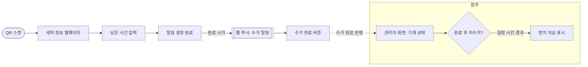

# WashPing 기획서

## 문제 정의

셀프빨래방에서 세탁이 끝난 뒤에도 세탁물이 오래 방치되어, **이용자는 종료 시각을 놓쳐 세탁물을 늦게 찾고 · 점주는 기계 회전율 저하와 "빈 기계가 없다"는 민원**을 겪는다.

## 타겟 사용자 · 포지셔닝

### 시장 관찰
- QR/스마트 기능을 **지원하는** 매장은 키오스크와 기기가 **하드웨어로 연동**(기기 고유 ID 기반)되어 있다. 실제 지원 매장을 방문해 확인함.
- 이 하드웨어 연동은 **우리가 당장 구현하기 어렵다**(기기 제조사·키오스크 연동 필요).
- 동네 대부분의 매장은 이런 기능이 **아직 없다.** 브랜드마다 지원 여부가 다르고, 비용 때문에 설치를 못 한 점주도 많다.

### 타겟
**QR/스마트 연동이 안 된 매장**(브랜드 무관)과 그곳의 이용자·점주.

### 차별점 (핵심 강점)
- 기기와의 하드웨어 연동 없이, 이용자가 **기계에 표시된 남은 시간을 직접 입력**하는 방식.
- 그래서 **어떤 브랜드의 빨래방에서도, 별도 설비 없이** 바로 작동한다.
- 점주는 QR 스티커만 붙이면 되므로 도입 비용·장벽이 매우 낮다.

## 사용자 시나리오

### 이용자
1. 세탁기/건조기에 붙은 QR을 스캔한다 → 웹페이지가 열린다 (앱 설치 없음)
2. 기계에 표시된 남은 시간을 입력한다
3. 알림이 설정된다 (종료 시각 저장)
4. 세탁 완료 시각에 웹 푸시로 "수거해 주세요" 알림을 받는다
5. 세탁물을 찾고 "수거 완료"를 누른다

### 점주
1. 관리자 화면에서 기계별 이용 상태를 한눈에 본다
2. 완료 후 일정 시간이 지나도 미수거인 기계가 "방치 의심"으로 표시된다
3. 방치 의심 기계에 안내(공지/재알림)를 한다

## 핵심 기능 (2개)

- **① 수거 알림** — QR 스캔 → 남은 시간 입력 → 완료 시각에 웹 푸시 알림 전송.
  없으면 서비스가 성립 안 됨(필수성), 문제정의의 "종료 시각을 놓침"을 직접 해결(적합성).
- **② 방치 방지 (점주 화면)** — 완료 후 일정 시간 미수거 시 '방치 의심' 표시.
  점주 쪽 문제(회전율·민원)를 직접 해결. 판단 기준(분)은 `TBD`.

> 서브 기능(기계별 QR 식별, 고장 신고)은 위 2개를 받쳐주는 보조 기능으로 둔다.

> ⚠️ **핵심 기능 2개는 초안이다.** "넓게 펴면 다 얕아진다"는 원칙에 따라 지금은 2개로 좁혔지만, 검증 과정에서 **얼마든지 확장·교체될 수 있다**(예: 고장 신고, 이용 통계, 알림 재발송 등). 현재의 2개는 "이번 MVP의 필수 축"일 뿐 최종 고정값이 아니다.

## 화면 흐름 (User Flow)

## 화면 구조 (UI · IA)

핵심 기능 2개를 담는 **3개 화면**으로 구성한다.

| # | 화면 | 사용자 | 화면 단위 동작 |
|---|------|--------|----------------|
| 1 | **세탁 정보 화면** | 이용자 | QR로 진입 → 선택된 기계 정보 표시 → 남은 시간 입력 → "수거 알림 설정" |
| 2 | **알림 설정 완료 (결과)** | 이용자 | 예상 완료 시각 안내 → 완료 시각에 웹 푸시 → "수거 완료" 버튼으로 종료 |
| 3 | **점주 관리자 화면** | 점주 | 기계 목록·상태 뱃지 → 완료 후 미수거 기계 '방치 의심' 표시 → 매장 공지 |

- 화면 1·2는 **핵심 ① 수거 알림**, 화면 3은 **핵심 ② 방치 방지**에 각각 대응한다.
- 상태 뱃지는 색으로 구분: 사용 가능(초록) · 사용 중(기본) · 방치 의심(주황).

## 프로토타입

핵심 기능 2개가 실제로 어떻게 동작하는지 순수 HTML/CSS/JS로 만든 프로토타입.

- ▶ **[프로토타입 열어보기 (prototype.html)](prototype.html)** — 기계 선택·시간 입력·알림 설정·수거 완료까지 클릭으로 체험
- 🗺️ **[사용자 흐름도 (user-flow.html)](user-flow.html)** — 이용자·점주 흐름 시각화

> 로컬에서 `docs/prototype.html`을 브라우저로 열면 바로 동작을 확인할 수 있다.

## 미해결 / 추후 결정 (TBD)

- 방치 판단 시간 기준 (예: 완료 후 10분?) — 사용자 테스트로 확정
- 웹 푸시 권한 거부 시 대체 안내 방법
