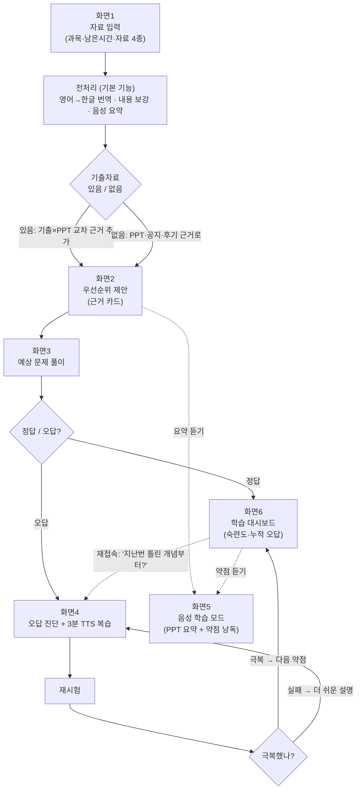

# ExamCast 기획안

> 기출자료와 강의자료를 교차 분석해 공부 우선순위를 근거와 함께 제안하고, 오답 기반으로 재학습시키는 AI 학습 Agent

---

## 1. 문제 정의

**시험을 앞둔 대학생은 자료가 부족해서가 아니라, 손에 쥔 기출·강의자료·후기를 조합해 "어디부터 공부할지" 정하는 일을 전부 혼자 해야 해서 막막하다.**

- 많은 교수가 기출과 문제 유형까지 배포하므로 자료는 이미 학생 손에 있다. 부족한 건 자료가 아니라 **자료를 엮어 우선순위로 바꾸는 과정**이다.
- 기출과 이번 학기 PPT를 대조해 반복·변형·신규 개념을 가려내는 일은 손으로 하기 어렵다.
- 예상 문제를 틀려도 그 오답이 "어떤 개념이 약한지"라는 진단으로 이어지지 않아, 매번 무엇을 다시 볼지 학생이 스스로 정해야 한다.

---

## 2. 사용자 시나리오

> 서비스 동작을 보여주기 위한 예시(가상 사례). 실제 데이터 검증은 본인 수강 과목으로 별도 수행한다.

운영체제 시험 3일 전인 대학생 지민.

1. **[입력]** 과목명 "운영체제", 남은 시간 "3일", 기출 "있음"을 선택하고 강의 PPT·기출 3개년·시험 공지·후기를 붙여넣은 뒤 **분석 시작**을 누른다.
2. **[우선순위]** "페이지 교체 알고리즘 — 기출 3년 연속 출제 + 올해 PPT 9주차 존재"처럼 **근거 카드**가 붙은 공부 우선순위 리스트를 받는다.
3. **[문제 풀이]** 우선순위 기반 예상 문제를 풀다가 TLB 문제를 틀린다.
4. **[오답 진단]** Agent가 "TLB miss와 page fault 혼동 → 주소 변환 흐름 이해 부족"으로 약점을 진단하고, 그 개념만 다루는 **3분 복습을 TTS로 재생**한다.
5. 유사 문제로 재시험을 봐 극복을 확인하면 숙련도가 오르고, Agent가 다음 약점 복습을 제안한다.

---

## 3. 핵심 기능 2개

"이게 없으면 서비스가 안 돌아가는" 기준으로, ExamCast의 핵심을 **두 개의 엔진**으로 좁힌다.

### 기능 1. 교차 분석 엔진 — 근거 카드 우선순위 제안

학생이 입력한 기출·PPT·공지·후기를 서로 대조해, 무엇부터 왜 공부하면 좋은지를 **근거와 함께** 우선순위 카드로 제안한다.

**왜 핵심인가** — 이 기능이 없으면 ExamCast는 다른 요약 도구와 구분되지 않는다. **학생 개인만 가진 데이터 조합(특정 교수의 기출 × 이번 학기 PPT × 그 수업 후기)을 우선순위로 바꾸는 것이 제품의 존재 이유**이며, 기출 유무로 전략을 스스로 분기하는 지점이 "요약이 아니라 전략"인 Agent다움을 처음 드러낸다.

**근거 생성 파이프라인** — 근거 카드는 자료를 한 번에 LLM에 넣어 뽑지 않는다. **분석 단위는 "과목 하나"**이며(다른 과목 자료는 배제해 근거 오염을 막는다), 다음 단계로 나눈다.

- **1단계 · 개념 구조화** — 기출·PPT·공지를 각각 독립적으로 `{개념명, 원본위치, 요약}` JSON으로 변환한다. "새 정보 생성"이 아니라 "있는 것을 태깅"하는 작업이라 환각 여지가 작고, 모든 근거가 원본 좌표를 갖는다.
  - **PPT를 개념 정본(canonical)으로 삼는다** — 개념 온톨로지를 새로 짓지 않고, PPT의 목차·슬라이드 제목을 **개념 마스터 리스트**로 둔다(개념 입도도 여기서 고정). 기출·공지의 표현("page fault")은 이 리스트에 **정렬(정규화)**해 붙인다 — 자유 태깅(불안정)이 아니라 고정 리스트 매핑(안정)이라 동의어 문제가 축소된다.
  - **원본 위치는 슬라이드 "제목/섹션"으로** — 붙여넣기 텍스트에서 번호는 쉽게 깨지지만 제목은 남고, 학생이 원본을 더 잘 찾는다.
- **1.5단계 · 교수 출제 유형 프로파일 (기출이 있을 때)** — 기출이 **1개라도** 있으면 `{출제 형식(객관식·OX·서술형 비율), 깊이(암기·응용·계산), 범위 편향, 문제 표현(지문·함정·배점)}`을 추출한다. 이 프로파일이 기출의 **1차 산출물**이며, 우선순위(기능1)와 "교수 스타일" 문제 생성(기능2) 양쪽의 입력이 된다.
- **2단계 · 개념 매칭** — 개념 리스트끼리 대조해 판정한다. **근거 축은 기출 보유량에 따라 켜진다**: 유형 프로파일·범위 편향·PPT 매칭은 기출 1개만 있어도 동작하고, 기출 반복(연도별 등장 카운트)은 여러 해가 있을 때 추가로 켜지는 **보너스 축**이다. 그 외 변형(유형 일치·수치 변경), 신규(PPT엔 있으나 기출엔 없음)를 판정하고 원본 위치를 부착해 근거 카드를 만든다. 중간·기말 기출은 각각 전반부·후반부 단원을 가리키므로 **남은 시험(중간/기말)에 맞춰 가중치**를 조정한다.

**기출은 "모드를 가르는 스위치"가 아니라 "근거를 강화하는 입력"이다.** 사용자가 겪는 제품은 하나다 — 우선순위를 받고, 풀고, 약점을 극복한다. 기출은 그중 **우선순위 근거의 정확도를 높이는 입력 하나**일 뿐이다.
- **기출이 있으면** — "이 교수가 낸다"는 출제 이력 근거 + 유형 프로파일이 얹혀 근거가 진해진다. 기출 1개만 있어도 유형 프로파일이 켜지고, 연도 수는 반복 근거 축을 더 켜는 보너스다.
- **기출이 없으면** — PPT 비중·공지·후기·과목 보편 핵심으로 우선순위를 잡는다. 출제 이력 근거만 빠질 뿐, "우선순위 + 근거 카드"라는 결과물과 사용자 경험은 동일하다.

정직성은 화면 전체 "모드 라벨"이 아니라 **카드별 근거 강도**로 유지한다 — 기출 근거 카드는 진하게, 구조·공지 기반 카드는 옅게 표시하고 원본은 항상 함께 보여준다. "너는 지금 열등한 모드다" 같은 낙인은 없다.

**근거 검증 장치** — 근거가 잘못 연결되면(예: PPT에 없는 개념을 "9주차 존재"로 표기) 신뢰가 크게 깎인다. 각 근거 카드에 **원본 위치(어느 슬라이드·어느 기출 문항)를 함께 보여주고, 학생이 "이건 아닌 것 같다"를 표시**하면 해당 카드의 가중치를 낮춘다. "9주차 존재"·"3년 연속 출제"는 2단계 매칭 결과이지 LLM이 지어낸 문장이 아니므로, 이 원본 위치 표시가 항상 실제 좌표를 가리킬 수 있다. 학생 피드백은 다음 제안의 입력이 된다.

### 기능 2. 오답 루프 엔진 — 진단 → TTS 복습 → 재시험 → 숙련도

예상 문제 풀이 결과를 관찰해 오답을 개념 단위 약점으로 진단하고, 그 개념만 복습(TTS)시킨 뒤 재시험으로 극복 여부를 확인하며 숙련도를 누적한다.

**왜 핵심인가** — 오답과 숙련도가 다음 제안의 입력으로 **누적되는 상태**가 챗봇으로 재현할 수 없는 해자다. 또한 이 루프는 **기출이 없어도 동작**하므로 전체 사용자에게 가치를 준다. 다른 기능을 줄여도 이 루프의 완성도는 지킨다 — 오답 루프가 이 프로젝트의 정체성이다.

**숙련도 상태 모델** — "누적되는 상태"이려면 무엇이 쌓이는지 정의가 필요하다. 개념 단위로 저장한다(localStorage).
- **개념 노드** — 진단으로 식별된 약점 개념 하나가 노드 하나. `{개념명, 상태, 점수, 최근 오답 이력}`.
- **3단계 상태** — `약점`(틀림) → `학습중`(복습·재시험 진행) → `극복`(연속 2회 정답). 실패 시 `학습중`으로 되돌아가 더 쉬운 설명으로 재복습.
- **점수(0~100)** — 정답/오답·재시험 결과로 가감. 대시보드 게이지와 "다음 약점 제안" 우선순위의 근거값.

이 상태가 다음 교차 분석·출제의 입력이 되어, 재접속 시 "지난번 틀린 개념부터?"가 가능해진다.

**약점 진단의 신뢰 (무엇을 약점으로 볼 것인가)** — "틀림 = 약점"으로 바로 단정하지 않는다.
- **문제마다 대상 개념 태그를 생성 시점에 미리 부착**한다. 틀리면 그 태그가 약점 **후보**다. 한 문제가 여러 개념을 걸치면 후보가 여럿이므로 MVP는 **단일 개념 문제를 우선**해 진단 확정성을 높인다.
- **1회 오답은 "잠정", 같은 개념을 2회 이상 틀려야 "약점 확정"** — "연속 2정답=극복"의 대칭. 찍기·실수는 자동 구분이 불가하므로 이 다회-오답 기준으로 흡수한다.

**채점·문제 정답의 신뢰** — 루프가 돌려면 판정이 먼저 옳아야 한다.
- MVP는 **객관식·OX를 우선**해 판정을 확정적으로 만든다. 서술형은 **키워드 채점 + 애매 구간 명시**로 처리하고, 애매한 문항은 **학생이 직접 정정**할 수 있게 열어 둔다(정정 결과는 오답 데이터에 반영).
- 생성한 문제의 정답이 틀리면 학생을 잘못 가르치므로, 출제 시 **정답·해설·출처를 함께 생성하고 "복수정답/무정답 없는지" 자체 검증 1패스**를 돌린다. 계산·서술형 검증은 확장으로 미룬다.

### 기본 기능 · 스코프

핵심 2개가 차별점이라면, 아래는 학습 도구라면 기대되는 기본기(유니브AI 등 기존 서비스 수준)이면서 핵심 기능의 입력 품질을 끌어올리는 보조다. **4주 안에 두 핵심 엔진의 완성도를 지키기 위해** MVP / 확장으로 나눈다.

| Tier | 기능 | 사유 |
|---|---|---|
| **MVP · 핵심** | 교차 분석 엔진, 오답 루프 엔진 | 제품의 존재 이유. 완성도 최우선 |
| **MVP · 전처리·보조** | ① 영어→한글 번역, ② PPT 내용 보강, ③ 음성 학습(TTS) | 핵심 엔진의 입력 품질을 끌어올림 + TTS는 오답 복습의 필수 출력 채널 |
| **확장 · 4주 이후** | ④ PDF 내보내기, ⑤ 형광펜, ⑥ 상시 AI 튜터 | 핵심 가치 증명엔 불필요. 특히 ⑥ 튜터는 화면 컨텍스트 인식으로 비용이 핵심급 |

- **① 번역 · ② 보강**은 입력 직후 전처리. 원문을 덮어쓰지 않고 **원문과 병기**하며, 보강분은 "생성된 내용"으로 표시해 근거 카드가 항상 원본을 가리키게 한다.
- **③ 음성 학습**은 PPT 요약과 약점 개념을 **하나의 TTS 재생목록**으로 묶어, 통학 시간(10/20/30분)에 맞춰 귀로 듣는다. 자료 요약과 약점 복습이 같은 TTS 인프라를 공유한다.
- **MVP의 의미** — "덜 만든 것"이 아니라 "두 핵심 엔진 + 그 입출력에 직접 필요한 최소 보조로 제품 가치를 증명하는 버전". 확장 기능은 기획엔 남기되 4주 범위에서 제외한다.

---

## 4. 화면 흐름

> ▶ **동작 프로토타입 (순수 HTML/CSS):** [prototype/index.html](../prototype/index.html)
> — 핵심 2개 화면(근거 카드 우선순위 · 오답 루프 진단→복습→재시험)을 클릭해볼 수 있음.



- **기출 유무 분기**(화면1→2)와 **극복/실패 재판단 루프**(화면4)를 살려, Agent가 입력과 사용자 행동에 따라 매번 다르게 도는 구조를 시각화했다.
- 핵심 기능 2개에 해당하는 **화면2·화면4가 흐름의 중심**이다. 화면5(음성 학습)는 우선순위·대시보드 양쪽에서 진입하는 보조 분기(점선)로 표기했다.

---

## 5. Agent 아키텍처 — 왜 파이프라인이 아니라 Agent인가

*AI Agent Challenge*의 핵심 질문은 "이게 LLM을 여러 번 부른 파이프라인과 뭐가 다른가"다. ExamCast는 **상태를 관찰하고 다음 행동을 스스로 고르는 루프**를 갖는다는 점에서 파이프라인이 아니라 Agent다.

**관찰 → 판단 → 행동 → 재관찰 루프** (오답 루프가 이 구조 그대로다):

```
관찰: 학생이 TLB 문제를 틀림
  → 판단: "TLB miss ↔ page fault 혼동, 약점 = 주소 변환 흐름"
  → 행동(도구 선택): [복습]으로 그 개념만 3분 TTS 처방
  → 재관찰: 재시험 결과
  → 판단: 극복? →아니오→ [다음 행동 선택] 더 쉬운 설명 / 다른 유형 / 같은 개념 반복
                  →예→ 다음 약점으로, 없으면 대시보드
```

**Agent다움을 만드는 세 가지** (이미 설계에 있음, 여기서 명시):
1. **자율 판단** — 입력에 무엇이 있는지(기출·공지·후기 유무)를 스스로 보고 어떤 근거 축을 쓸지 정한다(§3). 사람이 지정하지 않는다.
2. **상태 기반 의사결정** — 숙련도 상태 모델(§3 기능2)이 다음 제안·출제·복습 순서를 바꾼다. 어제 틀린 것이 오늘의 행동을 결정한다.
3. **도구를 골라 쓰는 루프** — 아래 도구를 정해진 순서가 아니라 **상태에 따라** 호출한다.

| 도구 | 역할 | 언제 호출 |
|---|---|---|
| `구조화` | 자료 → 개념+원본위치 JSON | 자료 입력 시 (결과 캐싱) |
| `프로파일` | 기출 → 교수 출제 유형 | 기출이 있을 때만 |
| `매칭` | 개념 대조 → 근거 카드 | 우선순위 산출 시 |
| `출제` | 우선순위·프로파일 → 문제(+정답 태그) | 문제 풀이 진입 시 |
| `채점` | 답안 → 정오 판정 | 답 제출 시 |
| `진단` | 오답 → 개념 약점 | 오답 발생 시 |
| `복습` | 약점 개념 → 3분 TTS | 진단 후 |

핵심은 "LLM 한 번 호출로 답이 나온다"가 아니라, **Agent가 학습 상태를 보며 어떤 도구를 언제 쓸지 판단하고, 그 결과로 상태가 갱신되어 다음 판단이 달라진다**는 점이다.

---

## 6. 열린 이슈 · 구현 결정

### 6-1. 빈약 입력 / 저품질 입력 처리 (결정)

시나리오는 자료가 잘 갖춰진 이상적 상태를 가정하지만, 실제로는 PPT만 있고 기출·공지·후기가 비거나, "기출 있음"을 골랐는데 실제 내용이 거의 없거나, 후기가 서로 모순되는 경우가 흔하다. (이미지·손글씨 기출은 파일 파싱 제외이므로 학생이 직접 텍스트로 옮겨 넣는 전제)

**결정 — 모드를 나누지 않는다. 하나의 제품에서 근거 강도만 달라진다: ⓒ(얇게) + 근거 강도 조절(메인) + ⓑ(비차단 넛지).**

- **ⓒ 최소 하한선만 차단** — **학습자료(PPT 등) 최소 1개**만 필수. 원재료가 0이면 낼 게 없으므로 이때만 막고, 그 이상은 절대 막지 않는다.
- **근거 강도 조절이 메인** — 기출이 없어도 같은 결과물(우선순위 + 근거 카드)을 낸다. 출제 이력 근거만 빠지고 PPT·공지·후기·보편 핵심 근거로 채우며, 이는 **카드별 근거 강도**로 솔직히 표시된다. 화면 전체에 "커버 모드"·"낮음" 같은 라벨은 붙이지 않는다.
- **ⓑ 넛지** — 진행을 막지 말고 *"기출을 넣으면 '이 교수가 낸다'는 근거가 더 정확해져요"* 힌트만 띄운다.

**기출 1개라도 있으면 유형 프로파일이 켜진다** — 연도 수 부족은 반복 근거 축만 빠질 뿐이다.

| 상태 | 근거 구성 | 근거 강도 |
|---|---|---|
| 학습자료 0개 | — | **ⓒ 차단** (분석 불가) |
| PPT만, 기출 0개 | PPT 비중 + 공지·후기 + 보편 핵심 | 구조 기반 (옅음) + ⓑ 넛지 |
| 기출 1~2개년 | + 유형 프로파일·범위·출제 이력 | 진함 (반복 축 제외) |
| 기출 3년+ | + 반복 빈도 보너스 | 가장 진함 |

**과목 격리** — 다른 과목 기출은 아무리 많아도 이 과목 분석에서 배제한다(근거 오염 방지). 같은 교수의 스타일 전이는 확장으로 미룬다.

**부분 대응** — 자료가 적을 때 기본 기능 ②(PPT 보강)로 재료를 만들되, **보강분은 "생성된 내용"으로 표시**해 실제 근거와 구분한다. 다만 보강으로 없는 출제 신호를 만들 수는 없으므로 위 근거 강도 규칙과 함께 동작한다.

### 6-2. 구현 고려사항 (결정)

엣지케이스 점검에서 나온 실현가능성·UX·맥락 이슈의 결론.

| 이슈 | 결정 |
|---|---|
| **LLM 비용** | ① `구조화` 결과 캐싱(자료 안 바뀌면 재사용) ② 모델 티어링 — 태깅 등 대량·기계 작업은 저렴한 모델, 진단·근거 합성은 상위 모델 ③ 개발 중 반복 호출이 진짜 비용원이므로 캐싱으로 관리 |
| **TTS** | MVP는 브라우저 내장 **Web Speech API**(무료·한국어 지원)로 시작, 부족 시 클라우드 TTS로 확장 |
| **통학 크로스디바이스** | 통학은 "소비(듣기)"지 상태 변경이 아니므로 **상태 동기화는 하지 않는다.** "오늘의 약점 오디오"를 **mp3/링크로 폰에 전달**하는 콘텐츠 전달만 제공. localStorage 단일기기 유지 |
| **붙여넣기 입력** | 파일 파싱 제외 유지. 원본 위치를 **슬라이드 제목**으로 잡아 붙여넣기에서도 좌표가 안 깨지게 함 |
| **남은 시간 반영** | 우선순위 리스트의 **cut-off 값** — 개념당 학습시간 가정 × 남은시간 가용량 → "커버 가능 개념 수" 환산 → "볼 것/버릴 것" 구분. 오답 루프 분량도 연동 |
| **다중 과목** | 과목 = **독립 세션 단위.** 홈에 과목 카드 리스트, 상태 격리. 크로스과목 기능 없음 |
| **콜드스타트 신뢰** | 근거 카드에 **실제 원본 인용(슬라이드 제목·기출 문항)을 접어서 노출** → "지어낸 게 아님"을 첫 화면에서 증명 |
| **저작권·학칙** | "업로드 자료는 **본인 학습용**, 외부 공유·학습데이터화 안 함" disclaimer 명시 |

---

## 7. 성공 지표

"잘 동작했다"를 판정할 목표 수치.

| 지표 | 정의 | 목표 | 측정 |
|---|---|---|---|
| **오답 판정 정확도** (주) | 채점이 실제 정오와 일치하는 비율 | 객관식·OX ≥ 99%, 서술형 애매구간 정정율 ≤ 20% | 학생 "정정" 로그 대비 자동 채점 |
| **재시험 극복율** (주) | 약점 개념 중 `극복`에 도달한 비율 | ≥ 70% | 개념 노드 상태 전이 로그 |
| 근거 카드 정정율 (보조) | 학생이 "아닌 것 같다"로 내린 비율 | ≤ 15% | 근거 검증 피드백 로그 |

주 지표 2개는 오답 루프의 신뢰성을 사용자 행동 로그로 자동 측정하고, 보조 지표는 교차 분석의 근거 신뢰도를 감시한다.

**측정 표본 (4주 현실)** — 대규모 지표를 약속하지 않는다. **본인 백테스트(과거 실제 시험 대비) + 동료 소표본 베타(3~5명)**의 케이스 스터디 수준으로 정성·정량을 함께 본다. 위 수치는 지향점이며 소표본에서의 근사 달성으로 판단한다.
