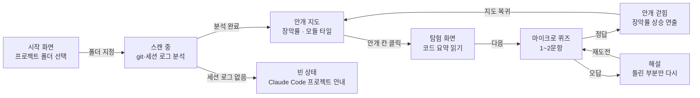

# 기획서 — 내 코드의 fog of war를 걷어내는 에이전트 (제품명 미정)

## 문제 정의

AI 도구로 개발하는 대학생 개발자가, 화면이 작동하니 코드를 이해하지 않고 넘어가다가, 막상 에러를 고치거나 "왜 이렇게 짰냐"는 질문을 받는 순간 자기 프로젝트인데도 어디를 봐야 할지 모른다.

## 사용자 시나리오

**온보딩 (첫 실행 1회)**

1. 앱을 켜고 프로젝트 폴더를 선택한다
2. 에이전트가 git 이력과 Claude Code 세션 로그를 스캔한다
3. 30초 뒤 첫 안개 지도를 본다 — "이 프로젝트의 40%가 안개 속입니다"

**핵심 루프 (매일)**

1. Claude Code로 기능을 완성하고 커밋한다 (화면 작동 확인)
2. 앱을 열고 지도 화면을 본다 — 모듈별 밝은 영역/안개 영역, 상단에 장악률 71%
3. 안개 칸 하나를 클릭한다
4. 탐험 화면 — 이 코드가 뭘 하는지 요약을 읽고, 퀴즈 1~2개를 푼다
5. 통과 — 안개가 걷히고 장악률이 오르는 연출을 본다 (오답이면 그 부분만 해설 후 재도전)

## 핵심 기능 (2개)

- **기능 A — 안개 지도**: Claude Code 세션 로그(JSONL)·git 이력을 분석해 "AI가 썼고 내가 접촉하지 않은 코드"를 모듈 지도 위에 안개로 시각화하고 장악률을 표시한다
- **기능 B — 탐험 세션**: 안개 칸을 클릭하면 LLM이 코드 요약과 마이크로 퀴즈 1~2문항을 생성하고, 통과하면 안개가 걷힌다 (세션당 3분 이내)

## 화면 흐름

---

## 부록

### A. 문제 발견 근거 (전부 1차 출처 확인)

- 본인 경험: 직전 프로토타입(ExamCast)을 "화면이 작동하니까" 그대로 쓰다가 프로젝트를 장악하지 못해 폐기
- 커밋 코드의 42%가 AI 보조 생성이지만 96%는 완전히 신뢰하지 않음 — [Sonar, State of Code 2026](https://www.sonarsource.com/blog/state-of-code-developer-survey-report-the-current-reality-of-ai-coding/)
- 개발자 59%가 이해 못 한 AI 코드를 그대로 사용 — [Clutch, 2025.06](https://clutch.co/resources/devs-use-ai-generated-code-they-dont-understand)
- AI 보조 그룹은 자기 코드 이해도 퀴즈에서 17% 낮음. 단, AI에 질문하며 쓴 그룹은 65% 이상 — 쓰는 방식이 가른다는 것이 이 제품의 존재 이유 — [Anthropic RCT, 2026.02](https://www.anthropic.com/research/AI-assistance-coding-skills)

### B. 선정 기준 기록

- 핵심 기능 판정: "없으면 서비스가 안 돌아가나"(필수성) × "문제정의를 해결하나"(적합성)
- 브리핑(늘어난 안개 알림)은 리텐션 기능이므로 핵심에서 제외 → 스트레치
- 탐험 기록·모듈 상세는 Later, 확장 방향은 부록 C-1 참고

### C. 아키텍처 방향

- 로컬 우선: 데이터(git, 세션 로그)가 전부 사용자 컴퓨터에 있음 → 로컬 Python(FastAPI) + React(localhost), 서버·OAuth 없음
- 프라이버시: 코드는 컴퓨터를 떠나지 않고, 탐험을 클릭한 코드 조각만 그 순간 LLM API로 전송
- 감지 엔진 기술 스파이크 통과 (2026.07.09): 실제 세션 로그에서 AI 파일 작업 내역 추출 검증
- 어댑터 구조: 감지 엔진을 "도구별 파서 → 공통 이벤트 형식(파일·시각·작업) → 지도·탐험 로직"으로 분리 — 아래 확장의 기반

### C-1. 확장 가능성 (두 축)

**도구 축 (옆으로)** — 특정 AI 도구 종속이 아님
- MVP: Claude Code 어댑터 (`~/.claude/projects` JSONL)
- 확장: Codex CLI — 같은 패턴의 로컬 JSONL(`~/.codex/sessions`), 파서 하나 추가로 지원
- Later: Cursor — SQLite 저장이라 난도 높음

**협업 축 (위로)** — 개인 도구에서 팀 도구로
- GitHub 연동으로 팀 레포의 안개 현황 공유 — "우리 팀 코드 중 아무도 이해 못 한 영역"의 가시화
- PR에 장악률 뱃지 — 캠프 PR 템플릿의 "내가 설명할 수 있는 부분/아직 이해 못 한 부분"을 자동화하는 것과 같은 맥락
- 신규 팀원 온보딩: 안개 지도가 곧 "이 레포에서 뭘 먼저 이해해야 하는지" 가이드가 됨

### D. 검증 계획

- 감지 엔진이 작동하는 시점(2주차)부터 도그푸딩: 이 프로젝트 레포 자체를 첫 분석 대상으로 삼아, 개발하며 쌓이는 안개를 이 도구로 걷는다 — "만드는 행위 = 검증하는 행위"
- 3주차: 캠프 동료 1명 레포에 첫 적용, 4주차: 2~3명으로 확대 — 첫 지도를 봤을 때의 반응 관찰
- 데모 데이 지표 (도그푸딩에서 자동 축적): 감지된 안개량, 탐험 세션 수, 장악률 변화 추이, 탐험 전후 퀴즈 정답률

### E. 작업 분해

`docs/checklist.md` 참고 — 확정 기능을 AI에게 내릴 수 있는 작업 단위로 직접 분해.
