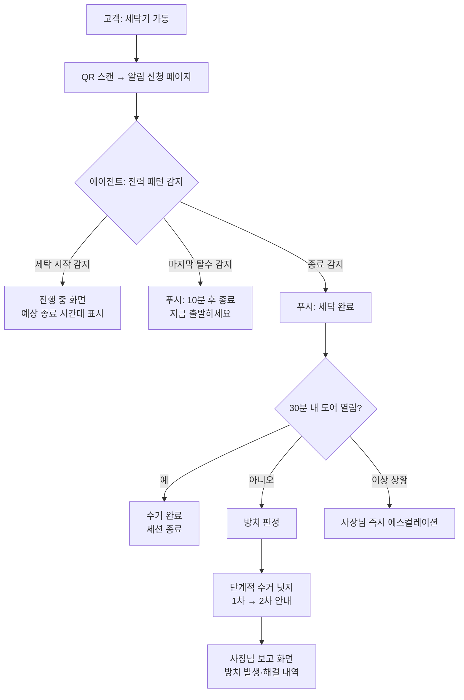

# 기획서 — 무인빨래방 AI 점장 에이전트 (가칭)

> v1(WashPing)은 "QR 찍으면 알림 주는" 알람 서비스여서 에이전트가 아니었다.
> v2는 센서로 매장을 스스로 감지하고, 판단하고, 행동하는 **운영 에이전트**로 재설계했다.

## 문제 정의

**무인빨래방 사장님이 매장에 없는 동안에도, 이용자들이 다 된 세탁물을 찾아가지 않아(방치) 기계 회전율이 떨어지고 다음 손님 민원까지 떠안으며 수시로 매장을 신경 써야 한다.**

- 누가: 무인빨래방 사장님
- 상황: 매장에 상주하지 않는 무인 운영 중
- 불편: 방치 세탁물 → 기계 점유 → 회전율 하락·민원, 이를 사장님이 원격으로 계속 감시·대응해야 함

(해결책이 아니라 문제를 적었는지 확인: "QR 알림 앱을 만든다" ❌ → 위 문장 ⭕)

## 사용자 시나리오

1. 고객이 세탁기를 돌리고, 세탁기에 붙은 QR을 찍어 알림을 신청한다 (앱 설치 없음)
2. 에이전트가 스마트플러그 전력 패턴으로 세탁 시작을 스스로 감지한다 (사람 입력 없음)
3. 마지막 탈수를 감지하면 고객에게 "약 10분 후 종료, 지금 출발하세요" 푸시를 보낸다
4. 종료 후 30분간 문이 열리지 않으면 방치로 판정하고, 고객에게 단계적 수거 알림을 보낸다
5. 사장님은 아무 개입 없이, 저녁에 "오늘 방치 3건 발생 → 3건 자동 해결" 보고만 받는다
6. (에이전트가 처리 못 하는 이상 상황만 사장님에게 즉시 에스컬레이션된다)

## 핵심 기능 (2개)

### 기능 A — 기계 상태 자동 감지 (에이전트의 감각)
- 스마트플러그 전력 패턴으로 **시작 / 탈수 / 종료**를 사람 입력 없이 판정
- 도어 센서와 조합해 **수거 완료 / 방치**를 판정
- 선정 이유(필수성): 이게 없으면 시스템에 눈이 없다. v1이 실패한 지점(사람이 입력해야 함)을 직접 해결

### 기능 B — 방치 자동 대응 (에이전트의 행동)
- 종료 → 고객 완료 알림 → 미수거 시 **단계적 수거 넛지** → 처리 결과를 사장님께 보고
- 선정 이유(적합성): 문제 정의(방치로 인한 사장님의 감시·대응 노동)를 정면으로 해결. 감지만 있고 대응이 없으면 대시보드일 뿐, 에이전트가 아니다

### 서브 기능 (이번 범위 아님 — 의식적으로 제외)
- 코스 분류·종료 시각 예측 고도화, 사장님 일일 리포트, 고객 문의(환불 등) 자동 처리, 상습 방치 고객 패턴 분석

## 화면 흐름 (User Flow)

## 화면 목록 (IA)

| 화면 | 사용자 | 내용 |
|---|---|---|
| 알림 신청 (QR 랜딩) | 고객 | 기계 번호 자동 인식, 알림 신청 버튼, (선택) 코스 선택 |
| 진행 중 | 고객 | 예상 종료 시간대, 기계 상태 |
| 사장님 대시보드 | 사장님 | 기계별 상태 한눈에, 방치 발생·자동 해결 내역, 에스컬레이션 |

## 리스크와 검증 계획

- **세탁기 정격 전류가 16A 초과이거나 직결 배선이면 플러그 방식 불가** → 이번 주 명판 확인으로 검증, 막히면 CT 센서로 우회
- 검증 실험: 스마트플러그 1개로 실제 매장 세탁기 전력을 5초 간격 로깅 → 시작/종료가 곡선에서 구분되는지 확인

---

### 점검 (미션 9.2)

- 내 서비스가 푸는 문제 한 문장? → 문제 정의 참고 (해결책 아닌 문제로 서술됨)
- 핵심 기능을 왜 그 2개로? → 필수성(A 없으면 눈이 없음) + 적합성(B 없으면 대시보드)
- 흐름에서 빠진 화면은? → mermaid 흐름도에서 확인
